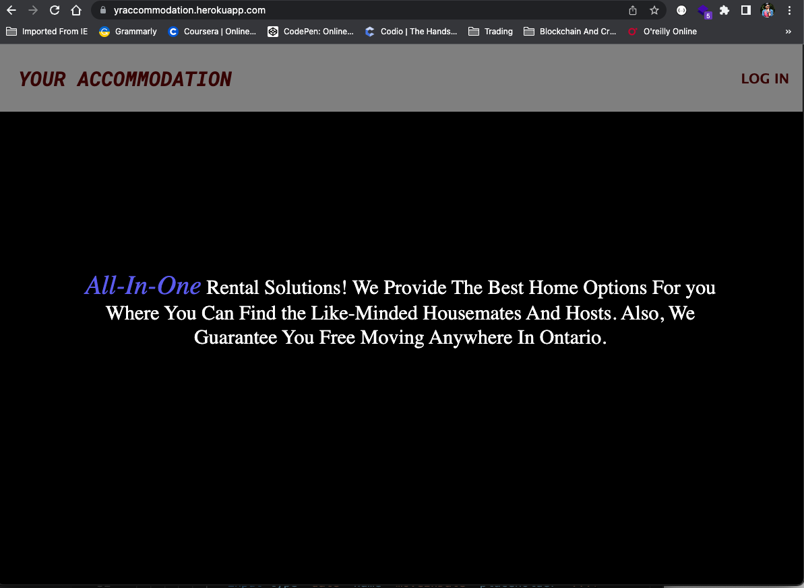
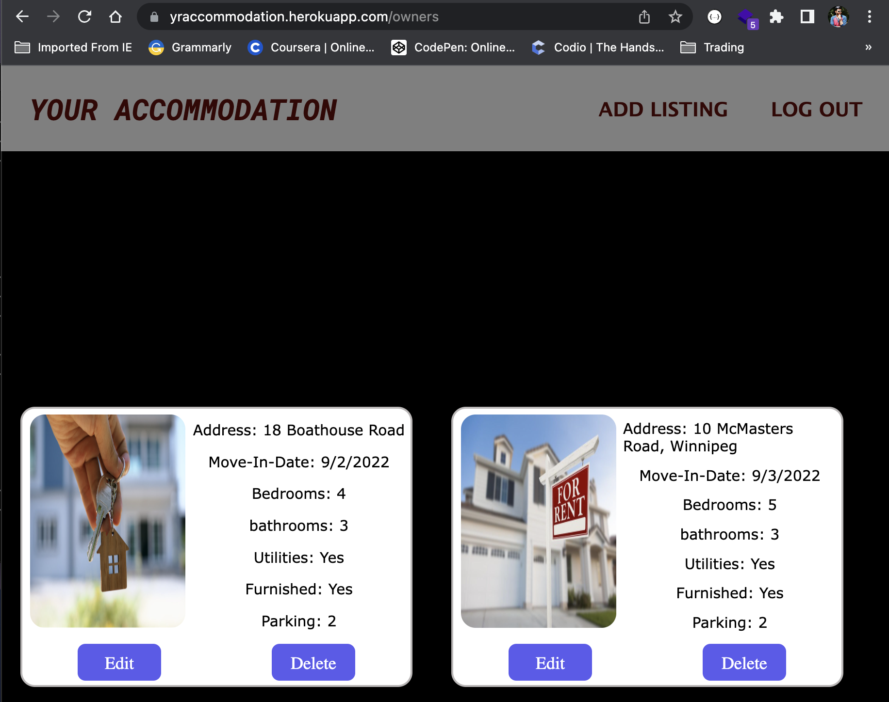
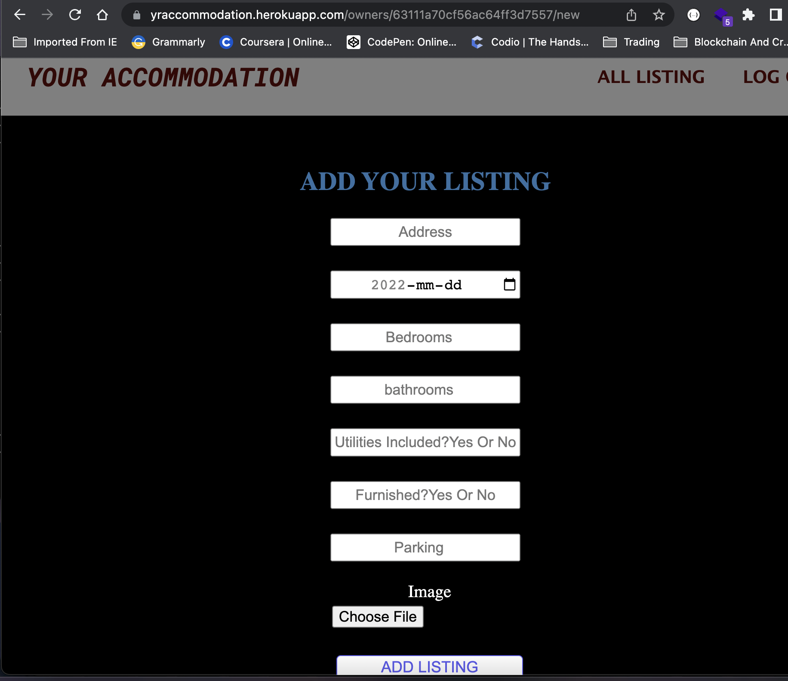
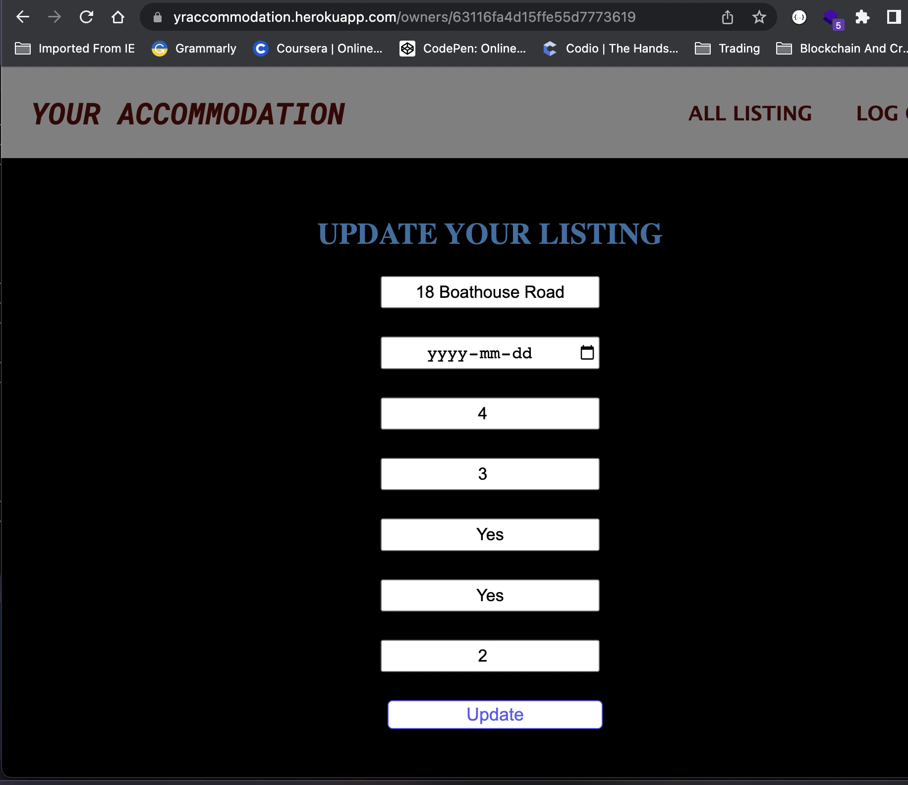

# Your Accommodation

---

## Overview
---
### The Purpose and the motive of this web app called "Your Accommodation" is to connect the home owners, property managers, and brokers with the potential tenants who are looking to rent house in their budget rent and preffered locations.
---

## Technologies
---

* I have utilized HTML and CSS to build interactive user interface with the thought of keeping it simple but decent to give user best experience with the best color combination for UI.
* I have used MongoDB to create database schema, and efficietly manipulate user data. Also, I utilized Node.js and Express to implement the backend tasks.
* I developed project using the popular Model-View-Controller(MVC) pattern to make it easy to navigate through!
---

### Log-In:

* Once the user is on the landing page of the app, user can choose to log in to the account using their google account where I have implemented Google OAuth 2.0 to authenticate and authorize the user.

* After, user has logged into the account, they will be on the main page or listing page where they can see their list of properties they have listed.

* If user does not have any properties listed and if they want to list new property they can click on "Add Listing" button from top right corner and that will show user a form to fill up in order to List the property. In addition, user can choose the image of the property to attract tenants. Here, I have implemented Imgur API to upload the image from the local file system.

* If at any point, user wants to update the property details, they can click on the Edit button and that will bring user to new page where they can edit and update the property details.

* Also, once the property is rented out than user can delete the property from the listing by simply clicking on the delete button.

* Moreover, there is log out button to log out of the account.
---

## Getting Started:
[Click To Open Web App](https://yraccommodation.herokuapp.com/)
---

## IceBox:
1. Add landing page where all the properties can be listed from all the users.
2. Add google map API
3. Allow user to choose multiple images using Imgur API.